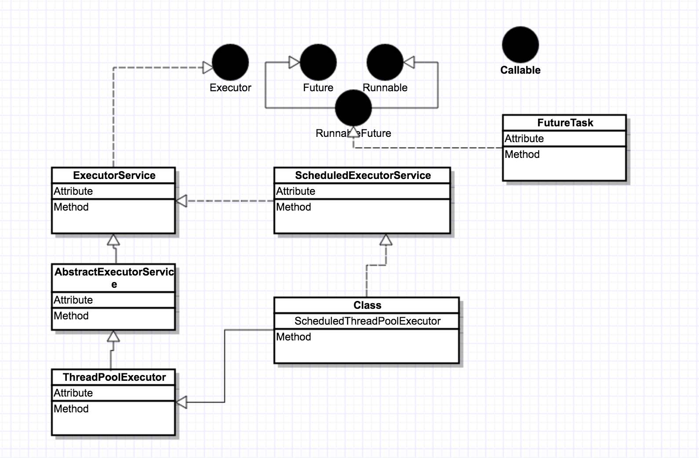
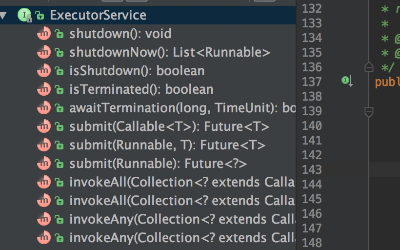

[TOC]

# 线程
## 1  线程wait,notify理解
### 1.1 why约定wait,notify需要在同步块里面调用？
首先看如下代码：

	看在调用wait的时候,需要先进入synchronized区域里面，即获取对象goods的锁，表示当前线程在goods对象上等待。goods.wait 可以这样理解，表示当前线程向goods发了一个wait信号，goods我们可以看成共享对象，由此可以想到，wait,notify其实就是2个线程通信，通过共享对象goods进行通信,所以在jdk里面需要一个线程在该对象wait,必须通过同一个对象发送notify信号才能唤醒。有木有深刻get到？这个其实是jvm不同线程通信的模型，通过共享内存通信。在想一下,这个模式在我们身边随处可见呐。比如2个系统要进行通信,常见做法是通过消息队列,数据库也可以。那么这个消息队列和数据库就相当于共享对象了。有木有？
	


### 1.2 为什么wait,notify方法在Object类里面？
这个很好理解啊，你想一下,看上面代码，线程等待被唤醒,其实就是个通信过程。通过共享对象进行通信,那么上面的理解就为A线程拿到对象goods的锁了,然后给goods.wait，即给goods发送了一个wait的消息。这个就表示当前线程告诉了goods了，说我要等待了的消息。然后线程A放弃了goods的锁了,等待了。然后另外一个线程B拿到goods的锁,goods.notify即表示,向goods发送一个消息表示要唤醒的消息。那么A线程感知到goods有notify消息的时候,表示有线程要唤醒我,于是就是等待队列切换到可执行队列里面,即具备执行了权限。可见,2个线程等待唤醒，都是通过goods的wait,notify传递信息。即共享对象。那么wait,notify方法肯定是定义在object里面。


## 2 interrupt中断理解
### 2.1 interrupt方法
代码片段
`thread.interrupt()` 该方法表示给thread发一个中断信号，注意理解中断，中断的意思就是阻止当前线程的执行状态，状态有可能是在执行中,有可能是处于wait中,例如线程如果调用了wait,sleep,join，这个时候中断表示使线程从wait状态中醒来。当这个interrupt方法被调用,会将flag置为ture.jdk会扫描该flag,如果发现变量为ture,则响应中断。（调用interrupt并不意味着立即停止目标线程正在进行的工作，只是传递了请求中断的消息，然后由线程在下一个合适的时刻中断自己，这些时刻称为取消点。wait，sleep，join 严格处理这种请求，当它们收到中断请求或者开始执行时发现中断状态，将抛出一个异常。取消点如何选定？
参考文献: http://www.cnblogs.com/lijunamneg/archive/2013/01/25/2877211.html ,linux系统线程的实现

(1)通过pthread_testcancel调用以编程方式建立线程取消点。   
(2)线程等待pthread_cond_wait或pthread_cond_timewait()中的特定条件。 
(3)  被sigwait(2)阻塞的函数   
(4)一些标准的库调用。通常，这些调用包括线程可基于阻塞的函数。根据POSIX标准，pthread_join()、pthread_testcancel()、pthread_cond_wait()、pthread_cond_timedwait()、sem_wait()、sigwait()等函数以及read()、write()等会引起阻塞的系统调用都是Cancelation-point，而其他pthread函数都不会引起Cancelation动作。
）

如果线程之前是wait状态的时候，那么响应中断就是抛出interruptException异常,同时将falg设置为false.如下：
```
try{
   object.wait() //被中断后会抛出InterruptException异常
}catch(InterruptException){
}
```
注意调用interrupt只是将flag设置为ture,至于什么时候响应中断那这个是jvm的响应了。jvm响应了是通过抛出异常以及复位中断标记。即throw InterruptException，以及flag=false 操作
  
### 2.2 thread.isInterrupted()
查看线程中断状态。如果调用了thread.interrupt()后，会将状态设置为ture.但有时候我们发现明显我们已经调用thread.interrupt方法,可是为什么thread.isInterrupted方法返回的还是false呢？这里其实可以理解，因为你调用完后,线程响应了中断状态。已经将中断标记复位了，即为false了。
注意：
线程静态方法Thread.interrupted()是线程静态方法
interrupt,`isInterrupted`是属性方法。


```java
  最新理解：
     摘自知乎
其实这是一个如何停止线程的问题，要真正理解interrupt()方法，要先了解

stop()方法。在以前通过thread.stop()可以停止一个线程，注意stop()方

法是可以由一个线程去停止另外一个线程，这种方法太过暴力而且是不安全的.

怎么说呢，线程A调用线程B的stop方法去停止线程B，调用这个方法的时候线程

A其实并不知道线程B执行的具体情况，这种突然间地停止会导致线程B的一些清

理工作无法完成，还有一个情况是执行stop方法后线程B会马上释放锁，这有可

能会引发数据不同步问题。基于以上这些问题，stop()方法被抛弃了。在这样的

情况下，interrupt()方法出现了，它与stop不同，它不会真正停止一个线

程，它仅仅是给这个线程发了一个信号告诉它它应该结束了（设置一个停止标

志）。真正符合安全的做法，就是让线程自己去结束自己，而不是让一个线程去

结束另外一个线程。通过interrupt()和.interrupted()方法两者的配合可

以实现正常去停止一个线程，线程A通过调用线程B的interrupt方法通知线程B

让它结束线程，在线程B的run方法内部，通过循环检查.interrupted()方法

是否为真来接收线程A的信号，如果为真就可以抛出一个异常，在catch中完成一

些清理工作，然后结束线程。Thread.interrupted()会清除标志位，并不是

代表线程又恢复了，可以理解为仅仅是代表它已经响应完了这个中断信号然后又

重新置为可以再次接收信号的状态。从始至终，理解一个关键点，interrupt()

方法仅仅是改变一个标志位的值而已，和线程的状态并没有必然的联系。理解了这点，其他的问题就很清晰了。
  
```
可见java设置这种中断机制主要还是为了方便安全的终止线程。

代码理解下，对于一个正常的线程即不是`wait,sleep,join`状态的线程，我们看看如何中断它

```java
public static void main(String[] args) {

        Thread t1 = new Thread(new Th2());
        t1.start();
        System.out.println("开始中断线程");
        t1.interrupt(); //中断


    }
    static class Th2 implements Runnable {
        @Override
        public void run() {
            System.out.println("正常线程");
           // System.out.println(Thread.interrupted()); //当前线程 返回为ture
 
    //不停的检查，有没有线程中断我，有则退出。
            while (!Thread.interrupted()) {
                System.out.println("没有人中断我继续我的工作");
            }
            System.out.println("中断状态为===》" + Thread.currentThread().isInterrupted() + "不做工作了 ,我要响应中断"); //返回为false

        }
    }
```
`Thread.interrupted()`这个方法为检查中断状态，并复位。什么意思呢?
即线程被中断了，第一次调用Thread.interrupted()；方法会将flag设置为true,第二次调用马上又会设置成false.

可以看到，java的中断机制只是发送一个信号，最后怎么处理还是看线程自己。有的人可能会说了，这么简单为什么我们不自己在应用层面实现呢?比如给一个全局变量，然后线程去检测这个变量，普通情况下是可以这样做的。特别地，就是如果一个线程在阻塞状态时和等待状态时，它应该如何发现这个标记变量的变化。wait方法声明为native，则证明这部分是涉及操作系统上面的线程机制，即使没有显示地判断中断标记位，这些方法仍然能够抛出interrupt exception。既然jvm层面已经帮我们实现了为啥不去用呢？


## 3 join理解
`thread.join()` 表示的意思线程加入到当前线程中，一定要理解当前线程这个概念，当前线程就是运行thrad.join代码的这个线程，join的意思就是将当前线程阻塞，调度给thread线程运行。但是有个前提条件就是thread必须是alive的。也就是thread必须start状态的。
## 4 volaite 关键字理解
voloite只能修饰变量，它的语义是保证线程可见，即将线程的工作内存数据刷新到主内存中去。这个可以根据jvm得内存模型得出来。注意它只能保证可见性，并不能保证线程安全。比如对应`private volaite int x = 4` 比如这个变量，如果有2个线程在对它写，则会有线程安全问题。
比如A线程将x 改为 x+1 即结果为5，线程B,也执行加1操作,由于它读到的x也为4,而值为5是在它后面刷新到主内存，所以对对于线程B而已,加1得到结果也为5.与本该的6不符合。所以也会存在线程安全问题
## 5 countdownLatch源码解析
代码

```java
private static final class Sync extends AbstractQueuedSynchronizer {
        private static final long serialVersionUID = 4982264981922014374L;

        Sync(int count) {
            setState(count);
        }

        int getCount() {
            return getState();
        }
  
        //返回0,表示获取到锁,线程可以执行了,如果返回false则表示没有获取到锁,继续阻塞
        protected int tryAcquireShared(int acquires) {
            return (getState() == 0) ? 1 : -1; 
        }

        protected boolean tryReleaseShared(int releases) {
            // Decrement count; signal when transition to zero
            for (;;) {
                int c = getState();
                if (c == 0)
                    return false;
                int nextc = c-1;
                if (compareAndSetState(c, nextc))
                    return nextc == 0;
            }
        }
    }
    //可以看到这个await方法是调用的可中断的获取锁的实现
    // 由此可以看到，await操作只是判断state是否为0,如果不为0继续阻塞
    // 如果为0 则获取执行权限,线程不阻塞获的执行权限
     public void await() throws InterruptedException {
        sync.acquireSharedInterruptibly(1); //《1》
    }
    
     public final void acquireSharedInterruptibly(int arg)
            throws InterruptedException {
        if (Thread.interrupted())
            throw new InterruptedException();
        if (tryAcquireShared(arg) < 0)
            doAcquireSharedInterruptibly(arg);
    }
  
    //sync 是countDownLatch内部实现的一个队列同步器
    //所以我们看到,countDown 操作实际上将state递减操作,直到
    //state为0，
    public void countDown() {
        sync.releaseShared(1);
    }
   
     protected boolean tryReleaseShared(int releases) {
            // Decrement count; signal when transition to zero
            for (;;) {
                int c = getState(); //这个传递的值state就是从countDownLatch构造函数传递进来的
                
                //如果为0,表示还没有获取锁,这个时候release返回false
                if (c == 0) 
                    return false;
                int nextc = c-1;//递减
                if (compareAndSetState(c, nextc))//cas 设置值
                    return nextc == 0;//如果最后减1为0,表示释放成功
            }
        }

```
总结：
 1.await操作就是判断state状态是否为0,为0表示不阻塞。countDownLatch操作则将state状态递减。 这个实现跟AQS关系密切,下次单独写个md解析其实现原理
 2.该实现是可重入的。
## 6 semaphore实现


## 7 ReetankLock源码解析
  这个锁支持可重入，且是排它锁即同一时刻只能有一个线程进入临界区它有两种实现，一种是公平，一种是非公平。先看非公平实现
  
```java

 final void lock() {
 //如果当前stat状态为0表示可以获取同步状态，
            if (compareAndSetState(0, 1))
            //获取成功，设置当前线程为排它锁 目前持有的线程
           setExclusiveOwnerThread(Thread.currentThread());
            else //否则尝试获取同步状态
                acquire(1); //出发tryAcquire方法
        }

        protected final boolean tryAcquire(int acquires) {
            return nonfairTryAcquire(acquires);
        }
    }


 final boolean nonfairTryAcquire(int acquires) {
            final Thread current = Thread.currentThread();
            int c = getState(); //获取当前状态
            if (c == 0) { //如果为0表示可以获取
                if (compareAndSetState(0, acquires)) {
                    //设置当前线程为排它线程的owner
                    setExclusiveOwnerThread(current);
                    return true;
                }
            }
            //检查当前线程是否是之前同一个线程，实现可重入的重要手段，如果是同一个线程，则直接在stat状态上增加即可
            else if (current == getExclusiveOwnerThread()) {
                int nextc = c + acquires;
                if (nextc < 0) // overflow
                    throw new Error("Maximum lock count exceeded");
                setState(nextc);
                return true;
            }
            return false;
        }
        
        //释放锁
          protected final boolean tryRelease(int releases) {
            int c = getState() - releases; //先递减
            if (Thread.currentThread() != getExclusiveOwnerThread())
                throw new IllegalMonitorStateException();
            boolean free = false;
            if (c == 0) { //如果为stat为0 表示当前已经没有人持有锁了
                free = true;
                setExclusiveOwnerThread(null);//设置当前线程为null
            }
            setState(c);//设置stat状态
            return free;
        }
              
```
公平锁实现

```java 
protected final boolean tryAcquire(int acquires) {
            final Thread current = Thread.currentThread();
            int c = getState();
            if (c == 0) {
            //判断当前节点是否前驱节点，如果有说明当前节点前面还有，这个是实现公平的关键之处
                if (!hasQueuedPredecessors() &&
                    compareAndSetState(0, acquires)) {
                    setExclusiveOwnerThread(current);
                    return true;
                }
            }
            else if (current == getExclusiveOwnerThread()) {
                int nextc = c + acquires;
                if (nextc < 0)
                    throw new Error("Maximum lock count exceeded");
                setState(nextc);
                return true;
            }
            return false;
        }
```
可以看到只要明白了**AQS**这些真的so easy


## 8 理解voliate 和synchronized的区别
voliate修饰的变量被某个线程更改， 从底层来讲，语义为 将变量从高速缓存刷新到主内存，同时其他线程缓存的变量失效,需要重新从主内存拉取。就这样。
即对其他线程是可见的。
 
 x=1    x=1
 x=2    
 
## 9 AQS 实现总结
> 1.用一个state标记状态，即是否可以进入临界区。
> 2.用队列维护如果线程没有获取到进入临界区的状态则park该线程，并将线程入队列。用一个双向链表维护起来。
> 3.如果当前线程离开临界区，则upark 该节点的后继节点。

**需要注意**
  1.aqs其实就是维护了一个队列,出队,入队的操作,还有一些线程同的唤醒与阻塞。说白了，它就相当于一个指挥官控制着线程该如何进入临界区。
  2.实际上最终判断线程是否有权利进入临界区这个能力，AQS 通过`tryAcquire（int args）`这个方法暴露给子类去实现。这样子类就可以实现各种各样的同步器了。
  3.注意`tryAcquire（int args）` 理解这个方法里面的args 含义。其实它可以为任意值，他表示的就是 一个stat增加或减少的幅度值。比如当 args为2 。那么当线程进来的时候 newstate = currentState + args .当线程出去的时候 newstat = curretnState - args。即我们只要保证了
获取锁，和释放锁的步调一致即可。args随便取。 在有些同步器中stat=0表示
可以获取锁，其实这个也是可以由我们自己控制的。我们也可以设计成stat=-1表示可以获取同步空间。所以这个灵活性很大。不得不说这是个不错的设计。
AQS负责将麻烦的线程调度即怎么唤醒，怎么等待等一些操作自己实现。将判断是否具有进入临界区间留给子类实现


## 10 线程池原理分析

 这是一张大致的类图
 
只是把类标记出来，稍后一个个理解

**Executor:**

这个顶级接口只有一个方法execute，这个方法最终会执行提交上来的任务。它的职责是执行。
**ExecutorService**


这个接口继承了Executor接口，同时具备了服务的功能。

即具有提交任务，也有关闭拒绝任务的功能呢。
**AbstractExecutorService**
上面都是接口这个是抽象类。
我们看看这个类实现的方法

主要为将task封装成`FutureTask`。这个类后面解释
这个交给子类去实现，execute方法。在看看`invoke相关方法`

```java
public <T> List<Future<T>> invokeAll(Collection<? extends Callable<T>> tasks)
        throws InterruptedException {
        if (tasks == null)
            throw new NullPointerException();
        ArrayList<Future<T>> futures = new ArrayList<Future<T>>(tasks.size());
        boolean done = false;
        try {
            for (Callable<T> t : tasks) {
                RunnableFuture<T> f = newTaskFor(t);
                futures.add(f);
                execute(f);
            }
            for (int i = 0, size = futures.size(); i < size; i++) {
                Future<T> f = futures.get(i);
                if (!f.isDone()) {
                    try {
                        f.get();
                    } catch (CancellationException ignore) {
                    } catch (ExecutionException ignore) {
                    }
                }
            }
            done = true;
            return futures;
        } finally {
            if (!done)
                for (int i = 0, size = futures.size(); i < size; i++)
                    futures.get(i).cancel(true);
        }
    }
```
这个抽象类实现了sumbit方法，其中sumbit是一个模板方法而已。还有一些invokef方法，这些后面在讲。先把整个脉络梳理下。下面我们看看这个抽象类的实现类`ThreadPoolExecutor`

**ThreadPoolExecutor**
这个类比较重要，好像看到很多文章都对它进行了源码分析.先看看我们最关系的`execute`方法

```java
public void execute(Runnable command) {
        if (command == null)
            throw new NullPointerException();
        /*
         * Proceed in 3 steps:
         *
         * 1. If fewer than corePoolSize threads are running, try to
         * start a new thread with the given command as its first
         * task.  The call to addWorker atomically checks runState and
         * workerCount, and so prevents false alarms that would add
         * threads when it shouldn't, by returning false.
         *
         * 2. If a task can be successfully queued, then we still need
         * to double-check whether we should have added a thread
         * (because existing ones died since last checking) or that
         * the pool shut down since entry into this method. So we
         * recheck state and if necessary roll back the enqueuing if
         * stopped, or start a new thread if there are none.
         *
         * 3. If we cannot queue task, then we try to add a new
         * thread.  If it fails, we know we are shut down or saturated
         * and so reject the task.
         */
        int c = ctl.get();
        if (workerCountOf(c) < corePoolSize) { //如果当前线程少于核心线程，则新增一个线程
            if (addWorker(command, true))
                return;
            c = ctl.get();
        }
        if (isRunning(c) && workQueue.offer(command)) {
            int recheck = ctl.get();
            if (! isRunning(recheck) && remove(command))
                reject(command);
            else if (workerCountOf(recheck) == 0)
                addWorker(null, false);
        }
        else if (!addWorker(command, false))
            reject(command);
    }
```


 


 

