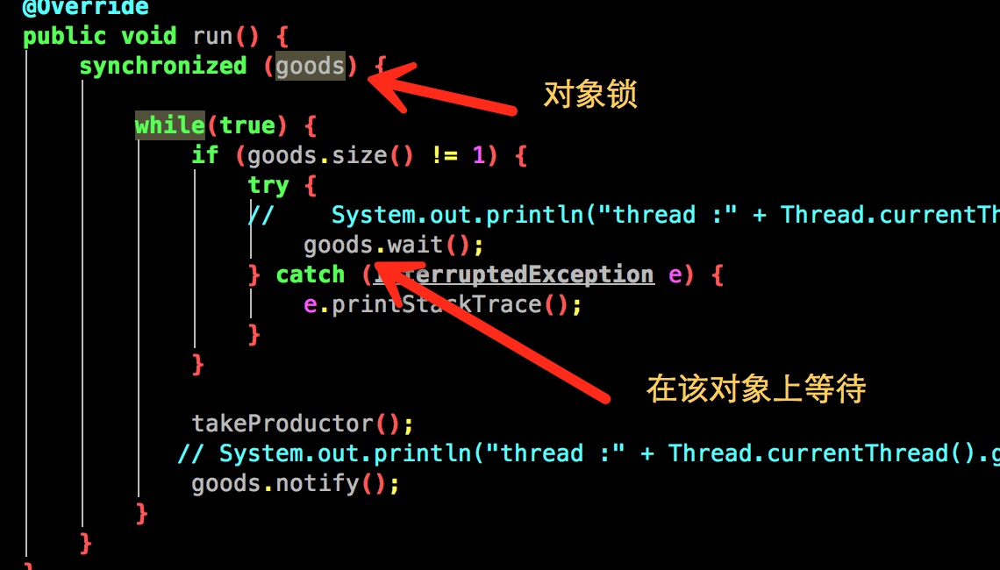

#线程
##线程wait,notify理解
###1:why约定wait,notify需要在同步块里面调用？
首先看如下代码：

	看在调用wait的时候,需要先进入synchronized区域里面，即获取对象goods的锁，表示当前线程在goods对象上等待。goods.wait 可以这样理解，表示当前线程向goods发了一个wait信号，goods我们可以看成共享对象，由此可以想到，wait,notify其实就是2个线程通信，通过共享对象goods进行通信,所以在jdk里面需要一个线程在该对象wait,必须通过同一个对象发送notify信号才能唤醒。有木有深刻get到？这个其实是jvm不同线程通信的模型，通过共享内存通信。在想一下,这个模式在我们身边随处可见呐。比如2个系统要进行通信,常见做法是通过消息队列,数据库也可以。那么这个消息队列和数据库就相当于共享对象了。有木有？
	

###2:为什么wait,notify方法在Object类里面？
这个很好理解啊，你想一下,看上面代码，线程等待被唤醒,其实就是个通信过程。通过共享对象进行通信,那么上面的理解就为A线程拿到对象goods的锁了,然后给goods.wait，即给goods发送了一个wait的消息。这个就表示当前线程告诉了goods了，说我要等待了的消息。然后线程A放弃了goods的锁了,等待了。然后另外一个线程B拿到goods的锁,goods.notify即表示,向goods发送一个消息表示要唤醒的消息。那么A线程感知到goods有notify消息的时候,表示有线程要唤醒我,于是就是等待队列切换到可执行队列里面,即具备执行了权限。可见,2个线程等待唤醒，都是通过goods的wait,notify传递信息。即共享对象。那么wait,notify方法肯定是定义在object里面。

